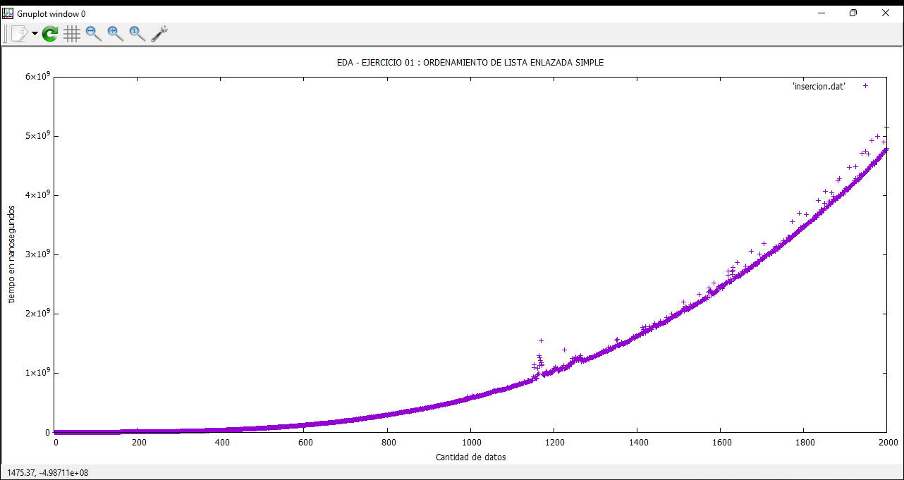
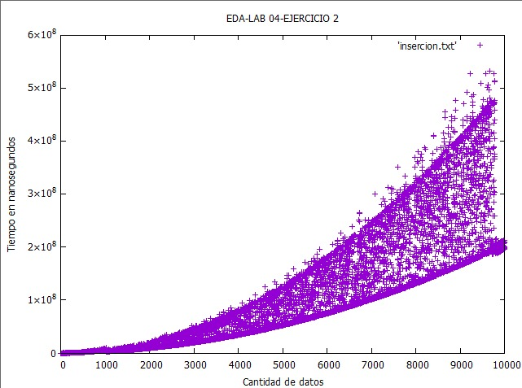
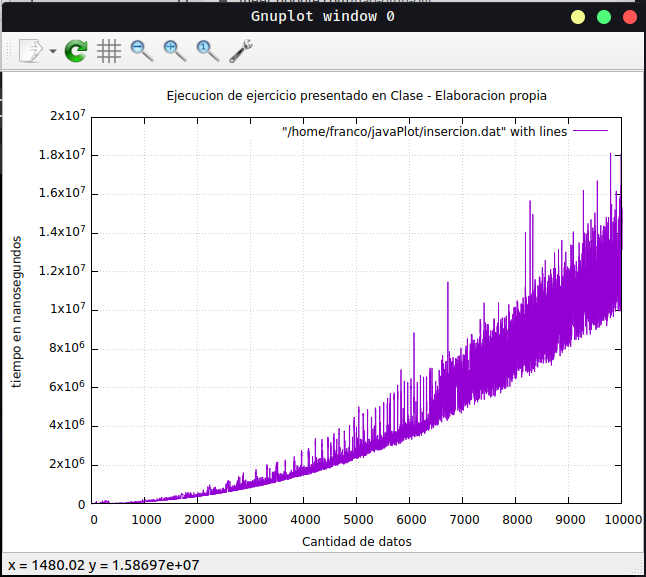

<div align="center">
<table>
    <theader>
        <tr>
            <td></td>
            <th>
                <span style="font-weight:bold;">UNIVERSIDAD NACIONAL DE SAN AGUSTIN</span><br />
                <span style="font-weight:bold;">FACULTAD DE INGENIERÍA DE PRODUCCIÓN Y SERVICIOS</span><br />
                <span style="font-weight:bold;">ESCUELA PROFESIONAL DE INGENIERÍA DE SISTEMAS</span>
            </th>
            <td></td>
        </tr>
    </theader>
    <tbody>
        <tr><td colspan="3"><span style="font-weight:bold;">Formato</span>: Guía de Práctica de Laboratorio / Talleres / Centros de Simulación</td></tr>
        <tr><td><span style="font-weight:bold;">Aprobación</span>:  2022/03/01</td><td><span style="font-weight:bold;">Código</span>: GUIA-PRLD-001</td><td><span style="font-weight:bold;">Página</span>: 1</td></tr>
    </tbody>
</table>
</div>

<div>
<span style="font-weight:bold;">INFORME DE LABORATORIO</span><br />

<table>
<theader>
<tr><th colspan="6">INFORMACIÓN BÁSICA</th></tr>
</theader>
<tbody>
<tr><td>ASIGNATURA:</td><td colspan="5">Estructura de Datos y Algoritmos</td></tr>
<tr><td>TÍTULO DE LA PRÁCTICA:</td><td colspan="5">Sort y Listas Enlazadas</td></tr>
<tr>
<td>NÚMERO DE PRÁCTICA:</td><td>04</td><td>AÑO LECTIVO:</td><td>2022 A</td><td>NRO. SEMESTRE:</td><td>III</td>
</tr>
<tr>
<td>FECHA DE PRESENTACIÓN:</td><td>12/06/2022</td><td>HORA DE PRESENTACIÓN:</td><td colspan="3"></td>
</tr>
<tr><td colspan="3">INTEGRANTE(s):
<ul>
<li>Cárdenas Martínez Franco Luchiano - fcardenasm@unsa.edu.pe</li>
<li>Carrillo Daza Barbara Rubi - bcarrillo@unsa.edu.pe</li>
<li>Diaz Portilla Carlo Rodrigo - cdiazpor@unsa.edu.pe</li>
<li>Hancco Condori Bryan Orlando - bhanccoco@unsa.edu.pe</li>
<li>Mamani Cañari Gabriel Anthony - gmamanican@unsa.edu.pe</li>
</ul>
</td>
<td>NOTA:</td><td colspan="2"></td>
</<tr>
<tr><td colspan="6">DOCENTE(s):
<ul>
<li>Richart Smith Escobedo Quispe - rescobedoq@unsa.edu.pe</li>
</ul>
</td>
</<tr>
</tbody>
</table>

<!-- Reportes -->
## SOLUCIÓN Y RESULTADOS

---

I. SOLUCIÓN DE EJERCICIOS/PROBLEMAS <br>
* La organización del repositorio es la siguiente
    ```sh
	.
	├── Ejercicio01
	│   ├── LinkedList.java
	│   ├── Node.java
	│   ├── TDAList.java
	│   └── Test.java
	├── Ejercicio02
	│   ├── DoubleLinkedList.java
	│   ├── Node.java
	│   ├── TDAList.java
	│   └── Test.java
	└── README.md
    ```
    Cada ejercicio tiene su respectivo test, se debera compilar y ejecutar como se indica en el cuestionario (Nota: Para la generacion de el archivo de texto se usaron rutas relativas).	
	
* Cada integrante tenía la tarea de solucionar los ejercicios agregando y/o modificando la información obtenida en las clases de teoría
    * **Ejercicio 1:** Algoritmo de Inserción en Lista Enlazada Simple<br><br>
Se Implemento el metodo [insertionSort](https://github.com/Barbara280801/EDA-2022-LAB04/blob/9a1908f1be1ad50ae8bc1b18f8b4becc1401b562/Ejercicio01/Test.java#L46 "insertionSort") para Listas enlazadas simples, este metodo aumenta su complejidad debido a quede para referenciar al elemento anterior se debe lllamar al metodo [get](https://github.com/Barbara280801/EDA-2022-LAB04/blob/9a1908f1be1ad50ae8bc1b18f8b4becc1401b562/Ejercicio01/Test.java#L61 "get") que tiene un orden n, esto genera un incremento en la complejidad del algoritmo , es por ello que se obtienen tiempos de ejecucion grandes en comparacion de las Listas doblemente enlazadas.
     
	```java	
        public static <E extends Comparable<E>> void insertionSort(LinkedList<E> list) {
             E key;
             int i;
             for (int j = 1; j < list.tamanio; j = j + 1) {
                 key = list.get(j).getDato();
                 i = j - 1;
                 while (i > -1 && list.get(i).getDato().compareTo(key) > 0) {
                     list.get(i + 1).setDato(list.get(i).getDato());
                     i = i - 1;
                 }
                 list.get(i + 1).setDato(key);
             }
         }
	```
	
	
	
	
    * **Ejercicio 2:** Algoritmo de Inserción en Lista Enlazada Doble
	
	- Para este ejercicio se creo una estructura de datos <code>DoubleLinkedList</code> donde cada <code>Node</code> tiene un next y previous node.
      - Iniciamos creando el algoritmo de inserción de una lista enlazada doble:

      ```java
      long nano_startTime = System.nanoTime();
      for (Node<E> key = list.get(0).getNext(); key != null; key = key.getNext()){
            Node<E> i = key.getPrevious();
            E aux = key.getData();
            while(i != null && i.getData().compareTo(i.getNext().getData()) == 1){
                    i.getNext().setData(i.getData());
                    i.setData(aux);
                    i = i.getPrevious();
            }
      }
      long nano_endTime = System.nanoTime();
      return nano_endTime - nano_startTime;
      ```

      - En este algoritmo se usa la ventaja de poder retroceder <code>getPrevious()</code> que tienen las listas dobles enlazadas.
      - Despues de obtener los datos de cada peor caso generado en un archivo <code>insercion.txt</code> obtenemos la siguiente gráfica:
	
	
	
    * **Adicional:** Ejecución del ejercicio de Clases<br>
	
	<br>
	
---

II. SOLUCIÓN DEL CUESTIONARIO

* ¿Cómo ejecutaría sus implementaciones desde terminal(consola)?¿Cómo lo haría desde la terminal?
    - Primero se instala [gnuplot](https://sourceforge.net/projects/gnuplot/files/gnuplot/5.4.3/ "gnuplot") en el sistema desde el enlace o de la siguiente manera:
      ```sh
      sudo apt install gnuplot
      ```
    - Luego descargar [JavaPlot](https://sourceforge.net/projects/gnujavaplot/files/latest/download "gnuplot") del enlace y descomprimirlo en un direcctorio a elección.
    - Finalizar las respectivas implementaciones sin olvidad agregar las respectivas importaciones
      ```java
      import com.panayotis.gnuplot.JavaPlot;
      ```
    - Compilar la implententacion , incluyendo las clases del proyecto 	
      ```sh
      javac -cp PATH_TO_JAVAPLOT/dist/JavaPlot.jar test.java [class1] [class2] ...
      ```
    - Finalmente ejecutar
      ```sh
      java -cp RUTA_A_JAVAPLOT/dist/JavaPlot.jar:. prueba
      ```
---

III. CONCLUSIONES
	
- En las listas enlazadas simples cada nodo tiene la referencia unicamente al siguiente nodo, haciendo imposible el trabajo de poder retroceder. Por otro lado, también tenemos dificultad de acceder a sus elementos, ya que cada vez que queremos acceder a un elemento tenemos que iterar hasta llegar al elemento que deseamos, en consecuencia, puede afectar algoritmos en los que tenemos que acceder precisamente a un elemento. 
	
- En las listas enlazadas dobles cada nodo tiene una referencia al nodo siguiente y al nodo anterior, mejorando el rendimiento de algoritmos en los que necesitamos ir atrás como el algoritmo de inserción.
	
- Dependiendo de la estructura de datos el algoritmo puede funcionar de una manera optima y en menos tiempo de lo que puede demorar con otro tipo de estructura de datos.
	
---
    
## RETROALIMENTACIÓN GENERAL
 <pre>
 
 </pre>
---
    
### REFERENCIAS Y BIBLIOGRAFÍA
<ul>
    <li>https://www.w3schools.com/java/</li>
    <li>https://www.eclipse.org/downloads/packages/release/2022-03/r/eclipse-ide-enterprise-java-and-web-developers</li>
    <li>https://javaplot.panayotis.com/</li>
    <li>https://sourceforge.net/projects/gnuplot/files/gnuplot/5.4.3/</li>
</ul>
